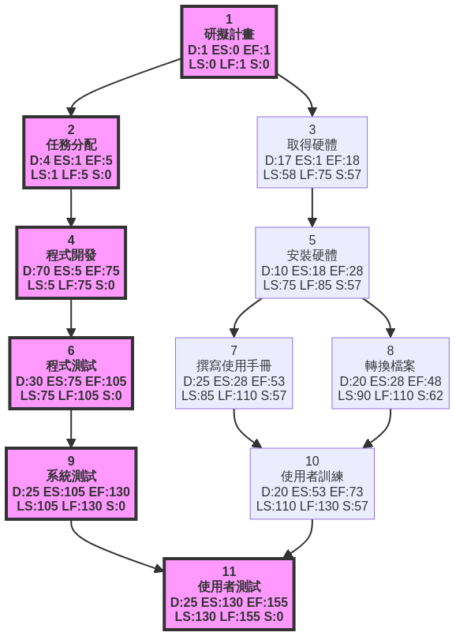
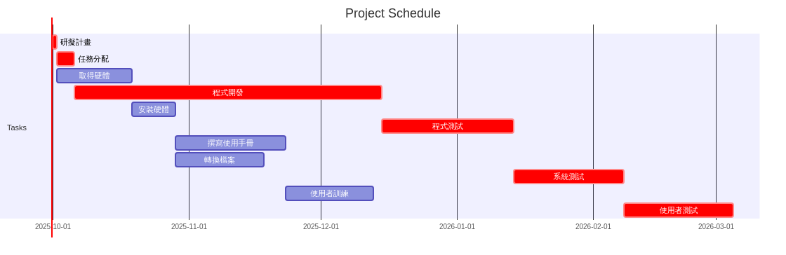

# 專案分析

## 1. 任務資料

|   任務編號 | 說明     |   需時(天) | 前置任務   |
|-------:|:-------|--------:|:-------|
|      1 | 研擬計畫   |       1 | -      |
|      2 | 任務分配   |       4 | 1      |
|      3 | 取得硬體   |      17 | 1      |
|      4 | 程式開發   |      70 | 2      |
|      5 | 安裝硬體   |      10 | 3      |
|      6 | 程式測試   |      30 | 4      |
|      7 | 撰寫使用手冊 |      25 | 5      |
|      8 | 轉換檔案   |      20 | 5      |
|      9 | 系統測試   |      25 | 6      |
|     10 | 使用者訓練  |      20 | 7,8    |
|     11 | 使用者測試  |      25 | 9,10   |

## 2. 關鍵路徑分析 (PERT/CPM)

|   任務編號 | 說明     |   需時(天) | 前置任務   |   最早開始(ES) |   最早完成(EF) |   最晚開始(LS) |   最晚完成(LF) |   浮時(Slack) | 是否關鍵路徑   |
|-------:|:-------|--------:|:-------|-----------:|-----------:|-----------:|-----------:|------------:|:---------|
|      1 | 研擬計畫   |       1 | -      |          0 |          1 |          0 |          1 |           0 | 是        |
|      2 | 任務分配   |       4 | 1      |          1 |          5 |          1 |          5 |           0 | 是        |
|      3 | 取得硬體   |      17 | 1      |          1 |         18 |         58 |         75 |          57 | 否        |
|      4 | 程式開發   |      70 | 2      |          5 |         75 |          5 |         75 |           0 | 是        |
|      5 | 安裝硬體   |      10 | 3      |         18 |         28 |         75 |         85 |          57 | 否        |
|      6 | 程式測試   |      30 | 4      |         75 |        105 |         75 |        105 |           0 | 是        |
|      7 | 撰寫使用手冊 |      25 | 5      |         28 |         53 |         85 |        110 |          57 | 否        |
|      8 | 轉換檔案   |      20 | 5      |         28 |         48 |         90 |        110 |          62 | 否        |
|      9 | 系統測試   |      25 | 6      |        105 |        130 |        105 |        130 |           0 | 是        |
|     10 | 使用者訓練  |      20 | 7,8    |         53 |         73 |        110 |        130 |          57 | 否        |
|     11 | 使用者測試  |      25 | 9,10   |        130 |        155 |        130 |        155 |           0 | 是        |

**專案總工期**: 155 天

**關鍵路徑**: 研擬計畫 -> 任務分配 -> 程式開發 -> 程式測試 -> 系統測試 -> 使用者測試

## 3. PERT/CPM 網路圖

以下是根據任務資料生成的PERT/CPM網路圖。圖中以紅色粗體標示的任務為關鍵路徑上的活動。

## 4. 甘特圖

甘特圖提供了一個視覺化的專案時間表，顯示了每個任務的開始和結束日期，以及它們的持續時間。關鍵路徑上的任務在此圖中也特別標示出來。

